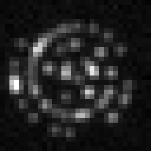
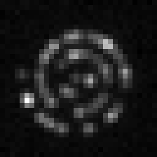
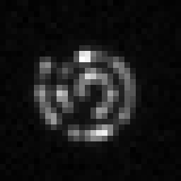

# 2DAiry_MEMF_HTR: 2D Airy PSF Multiple Emitter Multiple Frame High Temporal Resolution 

## Purpose
Evaluate and benchmark performance of localization algorithms in localization of multiple emitters from a data movie of multiple frames with high temporal resolution (1 second). 

## Method
### Three data movies 

Three data movies with different distances between adjacent emitters are synthesized and saved as tiff files with 16 bits in depth, each of which is stored in a zip file:

**2DAiry_MEMF_HTR_eD40nm_movie.zip  (For purpose of demonstration, .png images of the 10th frames are shown here.)**

**2DAiry_MEMF_HTR_eD30nm_movie.zip**

**2DAiry_MEMF_HTR_eD20nm_movie.zip**

### Submission 

For each data movie, the emitter locations (x,y) in nm shall be estimated and saved row by row in a .txt file: e.g.

4.4184628e+02   5.0638849e+03

4.2119986e+02   5.8867272e+03

... ...

4.1254239e+02   6.8510823e+03

The filenames in submission shall be in the format: 

**2DAiry_MEMF_HTR_eD40nm_xy_algorithmName.txt** 

**2DAiry_MEMF_HTR_eD30nm_xy_algorithmName.txt** 

**2DAiry_MEMF_HTR_eD20nm_xy_algorithmName.txt** 

## Parameters
The three data movies are synthesized by using the following parameters. 

### Emitter 

**Emitter distribution**

Emitters are located on a helix with different adjacent-emitter distance in three data movies.

|Data movie filename |Emitter distance| Unit|
|:-----|:-----|:-----|
|2DAiry_MEMF_HTR_eD40nm_movie.zip |40|nm|
|2DAiry_MEMF_HTR_eD30nm_movie.zip |30|nm|
|2DAiry_MEMF_HTR_eD20nm_movie.zip |20|nm|

**Number of emitters and emitter intensity (mean number of emitted photons)**

|Parameter |Variable and value| Unit|
|:-----|:-----|:-----|
|Number of emitters |M=250|  |
|Emitter intensity |I=300000|photons/sec/emitter|
|Analog digital unit |ADU=1|photons/unit|

**Emitter activation**

Each emitter is independently activated by following a Markov chain [2]. The matrix of state transition probabilities is 

| |0 |1 |2 |3 |4 |
|:-----|:-----|:-----|:-----|:-----|:-----|
|0 |r00=0.9188 |r01=0.5 |r02=0.7 |r03=0.8 |r04=1.0 |
|1 |r10=1-r00 |0   |0   |0   |0 |
|2 |0   |r21=1-r01 |0   |0   |0 |
|3 |0   |0   |r32=1-r02 |0   |0 |
|4 |0   |0   |0   |r43=1-r03 |0 |

rij indicates the transition probability from state j to i.  

### Data movie 
|Parameter |Variable and value| Unit|
|:-----|:-----|:-----|
|Region of view|[0,Lx] x [0,Ly] |nm| 
|Region of view size|Lx=2048, Ly=2048|nm|
|Pixel size |Dx=128, Dy=128|nm|
|Frame size |Kx=16, Ky=16|pixels|
|Frame time |Dt=0.01|sec|
|Movie length |N=100|frames |
|Correspondingly | |
|Frame rate|1/Dt=100|frames/sec|
|Photon count |Dt\*I=3000|photons/frame/emitter|
|Temporal resolution |TR=N\*Dt=1 |sec|
|Average number of activations per emitter|12|frames/emitter|
|Average number of activated emitters per frame|30|emitters/frame|

The corresponding 2D coordinate in a data frame is shown below. Note y axis points down. 

### Noise 
|Parameter |Variable and value| Unit|
|:-----|:-----|:-----|
|Mean of Poisson noise |b=15|photons/sec/nm2|
|Variance of Gaussian noise |G=10|photons/sec/nm2| 
|Mean of Gaussian noise |mu=0.5|photons/sec/nm2|

The mean of Gaussian noise includes the camera offset. 

**Corresponding signal to noise ratios**

|Parameter |Variable and value| Unit|
|:-----|:-----|:-----|
|Signal to Poisson noise ratio |rp=20000|nm2/emitter|
|                             |SPNR=43.01|dB|
|Signal to Gaussian noise ratio |rg=30000|nm2/emitter|
|                             |SGNR=44.77|dB|
|Total signal to noise ratio |r=12000|nm2/emitter|
|                           |SNR=40.79|dB|

### Optical system
|Parameter |Variable and value| Unit|
|:-----|:-----|:-----|
|Numerical aperture |na=1.4| |
|Fluorescence wavelength |lambda=520|nm|
|Standard deviation|78.26|nm|

PSF is 2D Airy and its standard deviation is estimated from an Airy PSF by sigma=1.3238/a where a=2\*pi\*na/lambda [1]. 

### Definitions
|Parameter |Definition| Unit|
|:-----|:-----|:-----|
|Signal to Poisson noise ratio |rp=I/b|nm2/emitter|
| |SPNR=10log10(rp)|dB|
|Signal to Gaussian noise ratio |rg=I/G|nm2/emitter|
| |SGNR=10log10(rg)|dB|
|Total signal to noise ratio |r=rp\*rg/(rp+rg)|nm2/emitter|
| |SNR=10log10(r)|dB|
