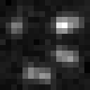
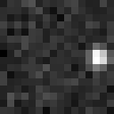
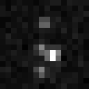

# 2DGauss_MEMF_LTR: 2D Gaussian PSF Multiple Emitter Multiple Frame Low Temporal Resolution 

## Purpose 
Evaluate and benchmark performance of localization algorithms in localization of multiple emitters from a data movie of multiple frames with low temporal resolution (10 seconds). 

## Method
### Three data movies 

Three data movies with different distances between adjacent emitters are synthesized and saved as tiff files with 16 bits in depth, each of which is stored in a zip file:

**2DGauss_MEMF_LTR_eD40nm_movie.zip  (For purpose of demonstration, .png images of the 10th frames are shown here.)**

**2DGauss_MEMF_LTR_eD30nm_movie.zip**

**2DGauss_MEMF_LTR_eD20nm_movie.zip**

### Submission 

For each data movie, the emitter locations (x,y) in nm shall be estimated and saved row by row in a .txt file: e.g.

4.4184628e+02   5.0638849e+03

4.2119986e+02   5.8867272e+03

... ...

4.1254239e+02   6.8510823e+03

The filenames in submission shall be in the format: 

**2DGauss_MEMF_LTR_eD40nm_xy_algorithmName.txt** 

**2DGauss_MEMF_LTR_eD30nm_xy_algorithmName.txt** 

**2DGauss_MEMF_LTR_eD20nm_xy_algorithmName.txt** 

## Parameters
The three data movies are synthesized by using the following parameters. 

### Emitter 

**Emitter distribution**

Emitters are located on a helix with different adjacent-emitter distance in three data movies.

|Data movie filename |Emitter distance| Unit|
|:-----|:-----|:-----|
|2DGauss_MEMF_LTR_eD40nm_movie.zip |40|nm|
|2DGauss_MEMF_LTR_eD30nm_movie.zip |30|nm|
|2DGauss_MEMF_LTR_eD20nm_movie.zip |20|nm|

**Number of emitters and emitter intensity (mean number of emitted photons)**

|Parameter |Variable and value| Unit|
|:-----|:-----|:-----|
|Number of emitters |M=500|  |
|Emitter intensity |I=300000|photons/sec/emitter|
|Analog digital unit |ADU=1|photons/unit|

**Emitter activation**

Each emitter is independently activated by following a Markov chain [2]. The matrix of state transition probabilities is 

| |0 |1 |2 |3 |4 |
|:-----|:-----|:-----|:-----|:-----|:-----|
|0 |r00=0.9928 |r01=0.5 |r02=0.7 |r03=0.8 |r04=1.0 |
|1 |r10=1-r00 |0   |0   |0   |0 |
|2 |0   |r21=1-r01 |0   |0   |0 |
|3 |0   |0   |r32=1-r02 |0   |0 |
|4 |0   |0   |0   |r43=1-r03 |0 |

rji indicates the transition probability from state i to j.  

**Stationary probability**

Correspondingly, the stationary probability of state i, i.e. the probability that up to the current frame, an emitter has been activated in i consecutive frames, is given below. The probability of deactivation is the probability that an emitter is not activated in a frame and the probability of activation is the probability that an emitter is activated in a frame. 

|Probability |Variable and value|
|:-----|:-----|
|Probability of state 0 |P0=0.9880|
|Probability of state 1 |P1=0.0071|
|Probability of state 2 |P2=0.0036|
|Probability of state 3 |P3=0.0011|
|Probability of state 4 |P4=0.0002|
|Probability of deactivation |P0=0.9880|
|Probability of activation |Pa=1-P0=0.0120|

### Data movie 
|Parameter |Variable and value| Unit|
|:-----|:-----|:-----|
|Field of view |[0,Lx] x [0,Ly] |nm| 
|Field of view size |Lx=4096, Ly=4096|nm|
|Pixel size |Dx=128, Dy=128|nm|
|Frame size |Kx=32, Ky=32|pixels|
|Frame time |Dt=0.01|sec|
|Movie length |N=1000|frames |
|Correspondingly | |
|Frame rate|1/Dt=100|frames/sec|
|Photon count |Dt\*I=3000|photons/frame/emitter|
|Temporal resolution |TR=N\*Dt=10 |sec|
|Average number of activations per emitter |Nape=Pa\*N=12|frames/emitter|
|Average number of activated emitters per frame |Naae=Pa\*M=6|emitters/frame|

The corresponding 2D coordinate in a data frame is shown below. Note y axis points down. 

### Optical system
|Parameter |Variable and value| Unit| |
|:-----|:-----|:-----|:-----|
|Numerical aperture |na=1.40| | |
|Fluorescence wavelength |lambda=723|nm|Dye Alexa 700 |
|Correspondingly| | | |
|Standard deviation |sigma=108.81|nm| |
|Full-width half-maximum |FWHM=256.22|nm| |

PSF is 2D Gaussian and its standard deviation is estimated from an Airy PSF by sigma=1.3238/a where a=2\*pi\*na/lambda [1]. 

### Noise 
|Parameter |Variable and value| Unit|
|:-----|:-----|:-----|
|Mean of Poisson noise |b=5|photons/sec/nm2|
|Variance of Gaussian noise |G=3|photons/sec/nm2| 
|Mean of Gaussian noise |mu=5|photons/sec/nm2|

**Corresponding signal to noise ratios and camera offset**

|Parameter |Variable and value| Unit|
|:-----|:-----|:-----|
|Signal to Poisson noise ratio |rp=60000|nm2/emitter|
|                             |SPNR=-3.97|dB|
|Signal to Gaussian noise ratio |rg=100000|nm2/emitter|
|                             |SGNR=-1.75|dB|
|Total signal to noise ratio |r=37500|nm2/emitter|
|                           |SNR=-6.01|dB|
|Effective camera offset |Coff=819.2 |photons/pixel|

The mean of Gaussian noise mu includes the effect of camera offset. When mu is solely contributed by the camera offset, i.e. the Gaussian noise has a zero mean, the effective camera offset is Coff=Dt\*Dx\*Dy\*mu. 

SPNR, SGNR, and SNR are defined in [4].
