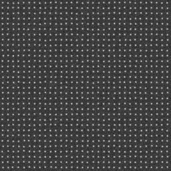
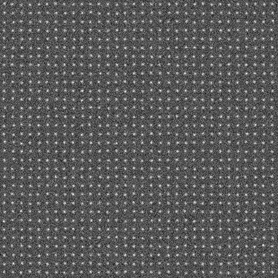

# 2DGauss_SESF: 2D Gaussian PSF Single Emitter Single Frame

## Purpose 
Evaluate and benchmark performance of localization algorithms in estimation of single isolated emitters from a single data frame. 

## Method
### Three data frames 

Three data frames with a high, medium, and low SNR are synthesized and saved as tiff files with 16 bits in depth:

**2DGauss_SESF_highSNR_Frame.tif (For purpose of demonstration, .png images are shown here.)**

**2DGauss_SESF_mediumSNR_Frame.tif**

**2DGauss_SESF_lowSNR_Frame.tif**

### Submission 

For each data frame, the emitter locations (x,y) in nm shall be estimated and saved  row by row in a .txt file: e.g.

4.4184628e+02   5.0638849e+03

4.2119986e+02   5.8867272e+03

... ...

4.1254239e+02   6.8510823e+03

The filenames in submission shall be in the format: 

**2DGauss_SESF_highSNR_xy_algorithmName.txt** 

**2DGauss_SESF_mediumSNR_xy_algorithmName.txt**

**2DGauss_SESF_lowSNR_xy_algorithmName.txt**

## Parameters
The three data frames are synthesized by using the following parameters. 

### Emitter distribution and intensity (mean number of emitted photons)
|Parameter |Variable and value| Unit|
|:-----|:-----|:-----|
|Number of emitters |M=1024|  |
|Emitter intensity |I=300000|photons/sec/emitter|
|Analog digital unit |ADU=1|photons/unit|

Within the field of view, each emitter is randomly distributed in a square of sizes 1088\*1088 (nm2) so that their PSFs are well isolated. 

### Data frame 
|Parameter |Variable and value| Unit|
|:-----|:-----|:-----|
|Field of view |[0,Lx] x [0,Ly] |nm| 
|Field of view size |Lx=35000, Ly=35000| nm|
|Pixel size |Dx=100, Dy=100|nm|
|Frame size |Kx=Lx/Dx=350, Ky=Ly/Dy=350 |pixels |
|Frame time |Dt=0.01|sec|
|Correspondingly | |
|Frame rate|1/Dt=100|frames/sec|
|Photon count |Dt\*I=3000|photons/frame/emitter|

The corresponding 2D coordinate in a data frame is shown below. Note y axis points down. 

### Optical system
|Parameter |Variable and value|Unit | |
|:-----|:-----|:-----|:-----|
|Numerical aperture |na=1.40| | |
|Fluorescence wavelength |lambda=723|nm|Dye Alexa 700 |
|Correspondingly| | | |
|Standard deviation |sigma=108.81|nm| |
|Full-width half-maximum |FWHM=256.22|nm| |

PSF is 2D Gaussian and its standard deviation is estimated from an Airy PSF by sigma=1.3238/a where a=2\*pi\*na/lambda [1]. 

### Noise and signal to noise ratio in three data frames  
|Data frame |Parameter |Variable and value| Unit|
|:-----|:-----|:-----|:-----|
|**2DGauss_SESF_highSNR_Frame.tif**|Mean of Poisson noise |b=0.3|photons/sec/nm2|
| |Variance of Gaussian noise |G=0.3|photons/sec/nm2| 
| |Mean of Gaussian noise |mu=5|photons/sec/nm2|
|Correspondingly |Signal to Poisson noise ratio |rp=1000000|nm2/emitter|
| |                             |SPNR=8.28|dB|
| |Signal to Gaussian noise ratio |rg=1000000|nm2/emitter|
| |                             |SGNR=8.28|dB|
| |Total signal to noise ratio |r=500000|nm2/emitter|
| |                           |SNR=5.24|dB|
| |Effective camera offset |Coff=500 |photons/pixel|
|**2DGauss_SESF_mediumSNR_Frame.tif**|Mean of Poisson noise |b=5|photons/sec/nm2|
| |Variance of Gaussian noise |G=3|photons/sec/nm2| 
| |Mean of Gaussian noise |mu=5|photons/sec/nm2|
|Correspondingly |Signal to Poisson noise ratio |rp=60000|nm2/emitter|
| |                             |SPNR=-3.97|dB|
| |Signal to Gaussian noise ratio |rg=100000|nm2/emitter|
| |                             |SGNR=-1.75.00|dB|
| |Total signal to noise ratio |r=37500|nm2/emitter|
| |                           |SNR=-6.01|dB|
| |Effective camera offset |Coff=500 |photons/pixel|
|**2DGauss_SESF_lowSNR_Frame.tif**|Mean of Poisson noise |b=20|photons/sec/nm2|
| |Variance of Gaussian noise |G=12|photons/sec/nm2| 
| |Mean of Gaussian noise |mu=5|photons/sec/nm2|
|Correspondingly |Signal to Poisson noise ratio |rp=15000|nm2/emitter|
| |                             |SPNR=-9.99|dB|
| |Signal to Gaussian noise ratio |rg=25000|nm2/emitter|
| |                             |SGNR=-7.77|dB|
| |Total signal to noise ratio |r=9375|nm2/emitter|
| |                           |SNR=-12.03|dB|
| |Effective camera offset |Coff=500 |photons/pixel|

The mean of Gaussian noise mu includes the effect of camera offset. When mu is solely contributed by the camera offset, i.e. the Gaussian noise has a zero mean, the effective camera offset is Coff=Dt\*Dx\*Dy\*mu. 
The SPNR, SGNR, and SNR are defined in [4]. 
