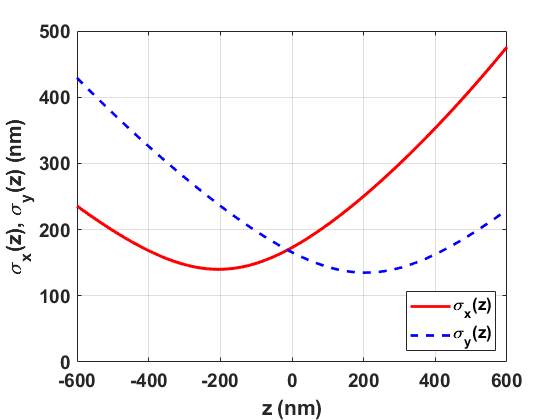

# 3DAS_MESF: 3D AS PSF Multiple Emitter Single Frame

## Purpose 
Evaluate and benchmark performance of localization algorithms in localization of multiple emitters with overlapped PSFs from a single data frame with a 3D astigmatic PSF. 

## Method
### Six data frames 

Six data frames with different emitter densities are synthesized and saved as tiff files with 16 bits in depth:

**3DAS_MESF_density0.1_Frame.tif  (For purpose of demonstration, .png images are shown here.)**

**3DAS_MESF_density0.3_Frame.tif  (For purpose of demonstration, .png images are shown here.)**

**3DAS_MESF_density0.5_Frame.tif  (For purpose of demonstration, .png images are shown here.)**

**3DAS_MESF_density1_Frame.tif  (For purpose of demonstration, .png images are shown here.)**

**3DAS_MESF_density2_Frame.tif**

**3DAS_MESF_density3_Frame.tif**

### Submission 

For each data frame, the emitter locations (x,y,z) shall be estimated and saved row by row in a .txt file: e.g.

4.4184628e+02   5.0638849e+03

4.2119986e+02   5.8867272e+03

... ...

4.1254239e+02   6.8510823e+03

The filenames in submission shall be in the format: 

**3DAS_MESF_density0.1_xyz_algorithmName.txt** 

**3DAS_MESF_density0.3_xyz_algorithmName.txt** 

**3DAS_MESF_density0.5_xyz_algorithmName.txt** 

**3DAS_MESF_density1_xyz_algorithmName.txt** 

**3DAS_MESF_density2_xyz_algorithmName.txt** 

**3DAS_MESF_density3_xyz_algorithmName.txt** 

## Parameters
The six data frames are synthesized by using the following parameters. 

### Emitter distribution and intensity (mean number of emitted photons)
|Parameter |Variable and value| Unit|
|:-----|:-----|:-----|
|Number of emitters |M=500|  |
|Emitter intensity |I=300000|photons/s/emitter|

Emitters are randomly and uniformly distributed in the cuboid [0,Lx] x [0,Ly] x [-Lz,Lz]. 

### Data frame 
|Parameter |Variable and value| Unit|
|:-----|:-----|:-----|
|Region of view|[0,Lx] x [0,Ly] x [-Lz,Lz] |nm| 
|Size of axial view |Lz=400 |nm| 
|Pixel size |Dx=100, Dy=100|nm|
|Frame size |Kx=Lx/Dx, Ky=Ly/Dy|pixels|
|Frame time |Dt=0.01|s|
|Correspondingly | |
|Frame rate|1/Dt=100|frames/s|
|Photon count |Dt\*I=3000|photons/frame/emitter|

### Region of view and frame size for six data frames 
|Data frame |Parameter |Variable and value| Unit|
|:-----|:-----|:-----|:-----|
|**3DAS_MESF_density0.1_Frame.tif** |Region of view size |Lx=71000, Ly=71000|nm|
|Correspondingly |Emitter density in lateral plane|0.1|emitters/um2|
|                |Frame size |Kx=710, Ky=710|pixels|
|**3DAS_MESF_density0.3_Frame.tif** |Region of view size |Lx=41000, Ly=41000|nm|
|Correspondingly |Emitter density in lateral plane|0.3|emitters/um2|
|                |Frame size |Kx=410, Ky=410|pixels|
|**3DAS_MESF_density0.5_Frame.tif** |Region of view size |Lx=32000, Ly=32000|nm|
|Correspondingly |Emitter density in lateral plane|0.5|emitters/um2|
|                |Frame size |Kx=320, Ky=320|pixels|
|**3DAS_MESF_density1_Frame.tif** |Region of view size |Lx=22000, Ly=22000|nm|
|Correspondingly |Emitter density in lateral plane|1|emitters/um2|
|                |Frame size |Kx=220, Ky=220|pixels|
|**3DAS_MESF_density2_Frame.tif** |Region of view size |Lx=16000, Ly=16000|nm|
|Correspondingly |Emitter density in lateral plane|2|emitters/um2|
|                |Frame size |Kx=160, Ky=160|pixels|
|**3DAS_MESF_density3_Frame.tif** |Region of view size |Lx=13000, Ly=13000|nm|
|Correspondingly |Emitter density in lateral plane|3|emitters/um2|
|                |Frame size |Kx=130, Ky=130|pixels|

The corresponding 2D coordinate in a data frame is shown below. Note y axis points down. 

### Noise 
|Parameter |Variable and value| Unit|
|:-----|:-----|:-----|
|Mean of Poisson noise |b=0.3|photons/s/nm2|
|Variance of Gaussian noise |G=0.2|photons/s/nm2| 
|Mean of Gaussian noise |mu=0.5|photons/s/nm2|

**Corresponding signal to noise ratios**

|Parameter |Variable and value| Unit|
|:-----|:-----|:-----|
|Signal to Poisson noise ratio |rp=1000000|nm2/emitter|
|                             |SPNR=60|dB|
|Signal to Gaussian noise ratio |rg=1500000|nm2/emitter|
|                             |SGNR=61.76|dB|
|Total signal to noise ratio |r=600000|nm2/emitter|
|                           |SNR=57.78|dB|

### Optical system
|Parameter |Variable and value| Unit|
|:-----|:-----|:-----|
|       |c=205, d=290|nm |
|       |sigmax0=140|nm |
|       |Ax=0.05, Bx=0.03| |
|       |sigmay0=135|nm |
|       |Ay=-0.01, By=0.02| |

PSF is 3D astigmatic [1]. The corresponding standard deviations in x and y as functions of z are shown below. 

### Definitions
|Parameter |Definition| Unit|
|:-----|:-----|:-----|
|Signal to Poisson noise ratio |rp=I/b|nm2/emitter|
| |SPNR=10log10(rp)|dB|
|Signal to Gaussian noise ratio |rg=I/G|nm2/emitter|
| |SGNR=10log10(rg)|dB|
|Total signal to noise ratio |r=rp\*rg/(rp+rg)|nm2/emitter|
| |SNR=10log10(r)|dB|
