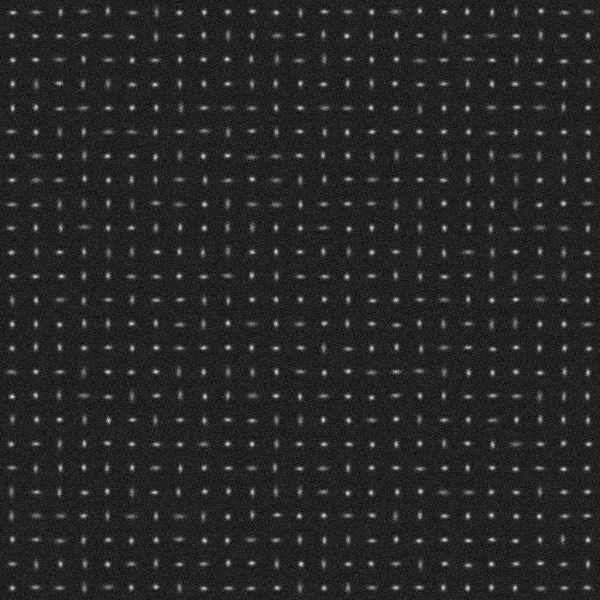

# 3DAS_SESF: 3D Astigmatic PSF Single Emitter Single Frame

## Purpose 
Evaluate and benchmark performance of localization algorithms in estimation of single isolated emitters from a single data frame. 

## Method
### Three data frames 

Three data frames with a high, medium, and low SNR are synthesized and saved as tiff files with 16 bits in depth:

**3DAS_SESF_highSNR_Frame.tif (For purpose of demonstration, .png images are shown here.)**

**3DAS_SESF_mediumSNR_Frame.tif**

**3DAS_SESF_lowSNR_Frame.tif**

### Submission 

For each data frame, the emitter locations (x,y,z) in nm shall be estimated and saved  row by row in a .txt file: e.g.

4.4184628e+02   5.0638849e+03   1.1171183e+02

4.2119986e+02   5.8867272e+03   -3.2331955e+02

... ...

4.1254239e+02   6.8510823e+03   2.3415149e+02

The filenames in submission shall be in the format: 

**3DAS_SESF_highSNR_xyz_algorithmName.txt** 

**3DAS_SESF_mediumSNR_xyz_algorithmName.txt**

**3DAS_SESF_lowSNR_xyz_algorithmName.txt**.

## Parameters
The three data frames are synthesized by using the following parameters. 

### Emitter distribution and intensity (mean number of emitted photons)
|Parameter |Variable and value| Unit|
|:-----|:-----|:-----|
|Number of emitters |M=625|  |
|Emitter intensity |I=300000|photons/sec/emitter|
|Analog digital unit |ADU=1|photons/unit|

Within the region of view, each emitter is randomly distributed in a cuboid of lateral sizes 2400\*2400 (nm2) and axial range [-400,400] nm so that their PSFs are well isolated. 

### Data frame 
|Parameter |Variable and value| Unit|
|:-----|:-----|:-----|
|Region of view|[0,Lx] x [0,Ly] x [-Lz,Lz] |nm| 
|Region of view size |Lx=60000, Ly=60000, Lz=400| nm|
|Pixel size |Dx=100, Dy=100|nm|
|Frame size |Kx=Lx/Dx=600, Ky=Ly/Dy=600|pixels|
|Frame time |Dt=0.01|sec|
|Correspondingly | |
|Frame rate|1/Dt=100|frames/sec|
|Photon count |Dt\*I=3000|photons/frame/emitter|

The corresponding 2D coordinate in a data frame is shown below. Note y axis points down. 

### Noise and signal to noise ratio in three data frames  
|Data frame |Parameter |Variable and value| Unit|
|:-----|:-----|:-----|:-----|
|**3DAS_SESF_highSNR_Frame.tif**|Mean of Poisson noise |b=0.05|photons/sec/nm2|
| |Variance of Gaussian noise |G=0.05|photons/sec/nm2| 
| |Mean of Gaussian noise |mu=5|photons/sec/nm2|
|Corresponding SNRs |Signal to Poisson noise ratio |rp=6000000|nm2/emitter|
| |                             |SPNR=67.78|dB|
| |Signal to Gaussian noise ratio |rg=6000000|nm2/emitter|
| |                             |SGNR=67.78|dB|
| |Total signal to noise ratio |r=300000|nm2/emitter|
| |                           |SNR=64.77|dB|
| |Effective camera offset |Coff=500 |photons/pixel|
|**3DAS_SESF_mediumSNR_Frame.tif**|Mean of Poisson noise |b=0.3|photons/sec/nm2|
| |Variance of Gaussian noise |G=0.2|photons/sec/nm2| 
| |Mean of Gaussian noise |mu=5|photons/sec/nm2|
|Corresponding SNRs |Signal to Poisson noise ratio |rp=1000000|nm2/emitter|
| |                             |SPNR=60.00|dB|
| |Signal to Gaussian noise ratio |rg=1500000|nm2/emitter|
| |                             |SGNR=61.76|dB|
| |Total signal to noise ratio |r=600000|nm2/emitter|
| |                           |SNR=57.78|dB|
| |Effective camera offset |Coff=500 |photons/pixel|
|**3DAS_SESF_lowSNR_Frame.tif**|Mean of Poisson noise |b=1.5|photons/sec/nm2|
| |Variance of Gaussian noise |G=1.0|photons/sec/nm2| 
| |Mean of Gaussian noise |mu=5|photons/sec/nm2|
|Corresponding SNRs |Signal to Poisson noise ratio |rp=200000|nm2/emitter|
| |                             |SPNR=53.01|dB|
| |Signal to Gaussian noise ratio |rg=300000|nm2/emitter|
| |                             |SGNR=54.77|dB|
| |Total signal to noise ratio |r=120000|nm2/emitter|
| |                           |SNR=50.79|dB|
| |Effective camera offset |Coff=500 |photons/pixel|

The mean of Gaussian noise mu includes the effect of camera offset. When mu is solely contributed by the camera offset, i.e. the Gaussian noise has a zero mean, the effective camera offset is Coff=Dt\*Dx\*Dy\*mu. 

### Optical system
|Parameter |Variable and value| Unit|
|:-----|:-----|:-----|
|       |c=205, d=290|nm |
|       |sigmax0=140|nm |
|       |Ax=0.05, Bx=0.03| |
|       |sigmay0=135|nm |
|       |Ay=-0.01, By=0.02| |

PSF is 3D astigmatic [1]. The corresponding standard deviations in x and y as functions of z are shown below. 

### Definitions
|Parameter |Definition| Unit|
|:-----|:-----|:-----|
|Signal to Poisson noise ratio |rp=I/b|nm2/emitter|
| |SPNR=10log10(rp)|dB|
|Signal to Gaussian noise ratio |rg=I/G|nm2/emitter|
| |SGNR=10log10(rg)|dB|
|Total signal to noise ratio |r=rp\*rg/(rp+rg)|nm2/emitter|
| |SNR=10log10(r)|dB|
