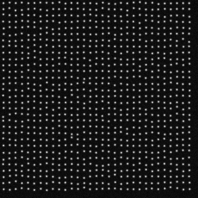
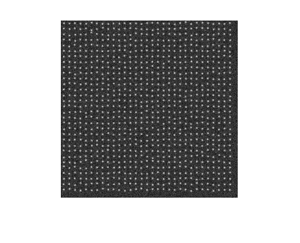
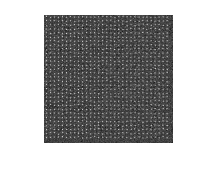
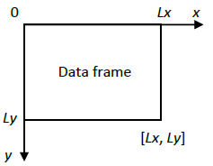

# SESF2DGauss: Single Emitter Single Frame 2D Gaussian PSF

## Purpose
Evaluate and benchmark performance of localization algorithms in estimation of single isolated emitters from a single data frame. 

## Method
### Three data frames 

Three data frames with a high, medium, and low SNR are synthesized and saved as tiff files with 16 bits in depth:

**SESF2DGauss_highSNR_Frame.tif**

**SESF2DGauss_mediumSNR_Frame.tif**

**SESF2DGauss_lowSNR_Frame.tif**

### Submission 

For each data frame, the emitter locations (x,y) shall be estimated and saved  row by row in a .txt file: e.g.

4.4184628e+02   5.0638849e+03

4.2119986e+02   5.8867272e+03

... ...

4.1254239e+02   6.8510823e+03

The file names in submission shall be in the format: 

**SESF2DGauss_highSNR_xy_algorithmName.txt** 

**SESF2DGauss_mediumSNR_xy_algorithmName.txt**

**SESF2DGauss_lowSNR_xy_algorithmName.txt**.

## Parameters
The three data frames are synthesized by using the following parameters. 

### Data frame 
|Parameter |Variable and value| Unit|
|:-----|:-----|:-----|
|Region of view|[0,Lx] x [0,Ly] |nm| 
|Region of view size |Lx=25000, Ly=25000| nm|
|Pixel size |Dx=100, Dy=100|nm|
|Frame size |Kx=Lx/Dx=250, Ky=Ly/Dy=250|pixels|
|Frame time |Dt=0.01|s|
|Correspondingly | |
|Frame rate|1/Dt=100|frames/s|
|Photon count |Dt\*I=3000|photons/frame/emitter|

The corresponding 2D coordinate in a data frame is shown below. Note y axis points down. 

### Emitter distribution and intensity (mean number of emitted photons)
|Parameter |Variable and value| Unit|
|:-----|:-----|:-----|
|Number of emitters |M=961| |
|Emitter intensity |I=300000|photons/s/emitter|

Within the region of view, each emitter is randomly distributed in a square of sizes 783x783 (nm2) so that their PSFs are well isolated. 

### Noise and signal to noise ratio in three data frames  
|Data frame |Parameter |Variable and value| Unit|
|:-----|:-----|:-----|:-----|
|**SESF2DGauss_highSNR_Frame.tif**|Mean of Poisson noise |b=0.5|photons/s/nm2|
| |Variance of Gaussian noise |G=0.5|photons/s/nm2| 
| |Mean of Gaussian noise |mu=0.5|photons/s/nm2|
|Corresponding SNRs |Signal to Poisson noise ratio |rp=600000|nm2/emitter|
| |                             |SPNR=57.78|dB|
| |Signal to Gaussian noise ratio |rg=600000|nm2/emitter|
| |                             |SGNR=57.78|dB|
| |Total signal to noise ratio |r=300000|nm2/emitter|
| |                           |SNR=54.77|dB|
|**SESF2DGauss_mediumSNR_Frame.tif**|Mean of Poisson noise |b=15|photons/s/nm2|
| |Variance of Gaussian noise |G=10|photons/s/nm2| 
| |Mean of Gaussian noise |mu=0.5|photons/s/nm2|
|Corresponding SNRs |Signal to Poisson noise ratio |rp=20000|nm2/emitter|
| |                             |SPNR=43.01|dB|
| |Signal to Gaussian noise ratio |rg=30000|nm2/emitter|
| |                             |SGNR=44.77|dB|
| |Total signal to noise ratio |r=12000|nm2/emitter|
| |                           |SNR=40.79|dB|
|**SESF2DGauss_lowSNR_Frame.tif**|Mean of Poisson noise |b=30|photons/s/nm2|
| |Variance of Gaussian noise |G=20|photons/s/nm2| 
| |Mean of Gaussian noise |mu=0.5|photons/s/nm2|
|Corresponding SNRs |Signal to Poisson noise ratio |rp=10000|nm2/emitter|
| |                             |SPNR=40.00|dB|
| |Signal to Gaussian noise ratio |rg=15000|nm2/emitter|
| |                             |SGNR=41.76|dB|
| |Total signal to noise ratio |r=6000|nm2/emitter|
| |                           |SNR=37.78|dB|

### Optical system
|Parameter |Variable and value| Unit|
|:-----|:-----|:-----|
|Numerical aperture |na=1.4| |
|Fluorescence wavelength |lambda=520|nm|
|Standard deviation|78.26|nm|

PSF is 2D Gaussian PSF and its standard deviation is estimated from an Airy PSF by sigma=1.3238/a where a=2\*pi\*na/lambda. 

### Definitions
|Parameter |Definition| Unit|
|:-----|:-----|:-----|
|Signal to Poisson noise ratio |rp=I/b|nm2/emitter|
| |SPNR=10log10(rp)|dB|
|Signal to Gaussian noise ratio |rg=I/G|nm2/emitter|
| |SGNR=10log10(rg)|dB|
|Total signal to noise ratio |r=rp\*rg/(rp+rg)|nm2/emitter|
| |SNR=10log10(r)|dB|
