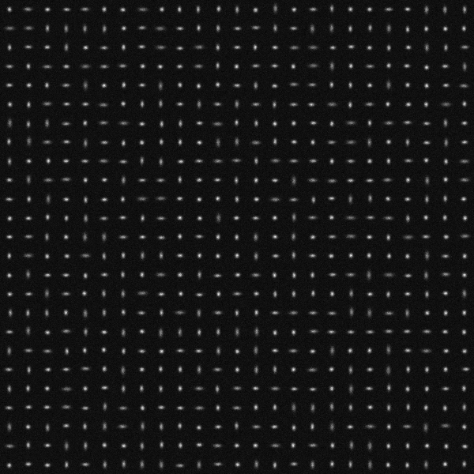
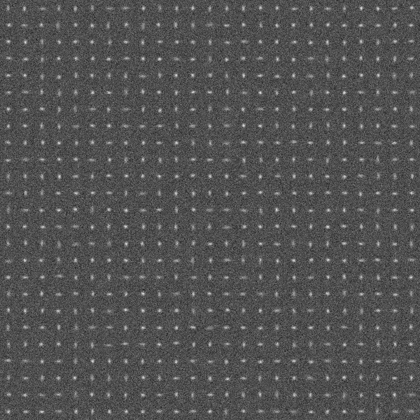

# SESF_3DAS: Single Emitter Single Frame 3D Astigmatic PSF

## Purpose
Evaluate and benchmark performance of localization algorithms in estimation of single isolated emitters from a single data frame. 

## Method
### Three data frames 

Three data frames with a high, medium, and low SNR are synthesized and saved as tiff files with 16 bits in depth:

**SESF_3DAS_highSNR_Frame.tif (For purpose of demonstration, .png images are shown here.)**

**SESF_3DAS_mediumSNR_Frame.tif**

**SESF_3DAS_lowSNR_Frame.tif**

### Submission 

For each data frame, the emitter locations (x,y,z) shall be estimated and saved  row by row in a .txt file: e.g.

4.4184628e+02   5.0638849e+03

4.2119986e+02   5.8867272e+03

... ...

4.1254239e+02   6.8510823e+03

The filenames in submission shall be in the format: 

**SESF_3DAS_highSNR_xy_algorithmName.txt** 

**SESF_3DAS_mediumSNR_xy_algorithmName.txt**

**SESF_3DAS_lowSNR_xy_algorithmName.txt**.

## Parameters
The three data frames are synthesized by using the following parameters. 

### Emitter distribution and intensity (mean number of emitted photons)
|Parameter |Variable and value| Unit|
|:-----|:-----|:-----|
|Emitter intensity |I=300000|photons/s/emitter|

Within the region of view, each emitter is randomly distributed in a cuboid of lateral sizes 2400\*2400 (nm2) and axial range [-400,400] nm so that their PSFs are well isolated. 

### Data frame 
|Parameter |Variable and value| Unit|
|:-----|:-----|:-----|
|Region of view|[0,Lx] x [0,Ly] x [-Lz,Lz] |nm| 
|Region of view size |Lx=60000, Ly=60000, Lz=400| nm|
|Pixel size |Dx=100, Dy=100|nm|
|Frame size |Kx=Lx/Dx=600, Ky=Ly/Dy=600|pixels|
|Frame time |Dt=0.01|s|
|Correspondingly | |
|Frame rate|1/Dt=100|frames/s|
|Photon count |Dt\*I=3000|photons/frame/emitter|

The corresponding 2D coordinate in a data frame is shown below. Note y axis points down. 

### Noise and signal to noise ratio in three data frames  
|Data frame |Parameter |Variable and value| Unit|
|:-----|:-----|:-----|:-----|
|**SESF_3DAS_highSNR_Frame.tif**|Mean of Poisson noise |b=0.05|photons/s/nm2|
| |Variance of Gaussian noise |G=0.05|photons/s/nm2| 
| |Mean of Gaussian noise |mu=0.5|photons/s/nm2|
|Corresponding SNRs |Signal to Poisson noise ratio |rp=6000000|nm2/emitter|
| |                             |SPNR=67.78|dB|
| |Signal to Gaussian noise ratio |rg=6000000|nm2/emitter|
| |                             |SGNR=67.78|dB|
| |Total signal to noise ratio |r=300000|nm2/emitter|
| |                           |SNR=64.77|dB|
|**SESF_3DAS_mediumSNR_Frame.tif**|Mean of Poisson noise |b=1.5|photons/s/nm2|
| |Variance of Gaussian noise |G=1|photons/s/nm2| 
| |Mean of Gaussian noise |mu=0.5|photons/s/nm2|
|Corresponding SNRs |Signal to Poisson noise ratio |rp=200000|nm2/emitter|
| |                             |SPNR=53.01|dB|
| |Signal to Gaussian noise ratio |rg=300000|nm2/emitter|
| |                             |SGNR=54.77|dB|
| |Total signal to noise ratio |r=120000|nm2/emitter|
| |                           |SNR=50.79|dB|
|**SESF_3DAS_lowSNR_Frame.tif**|Mean of Poisson noise |b=3|photons/s/nm2|
| |Variance of Gaussian noise |G=2|photons/s/nm2| 
| |Mean of Gaussian noise |mu=0.5|photons/s/nm2|
|Corresponding SNRs |Signal to Poisson noise ratio |rp=100000|nm2/emitter|
| |                             |SPNR=50.00|dB|
| |Signal to Gaussian noise ratio |rg=150000|nm2/emitter|
| |                             |SGNR=51.76|dB|
| |Total signal to noise ratio |r=60000|nm2/emitter|
| |                           |SNR=47.78|dB|

### Optical system
|Parameter |Variable and value| Unit|
|:-----|:-----|:-----|
|       |c=205, d=290|nm |
|       |sigmax0=140|nm |
|       |Ax=0.05, Bx=0.03| |
|       |sigmay0=135|nm |
|       |Ay=-0.01, By=0.02| |

PSF is 3D astigmatic [1]. 

### Definitions
|Parameter |Definition| Unit|
|:-----|:-----|:-----|
|Signal to Poisson noise ratio |rp=I/b|nm2/emitter|
| |SPNR=10log10(rp)|dB|
|Signal to Gaussian noise ratio |rg=I/G|nm2/emitter|
| |SGNR=10log10(rg)|dB|
|Total signal to noise ratio |r=rp\*rg/(rp+rg)|nm2/emitter|
| |SNR=10log10(r)|dB|
